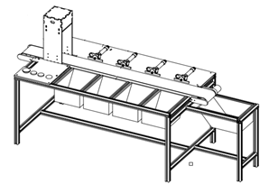
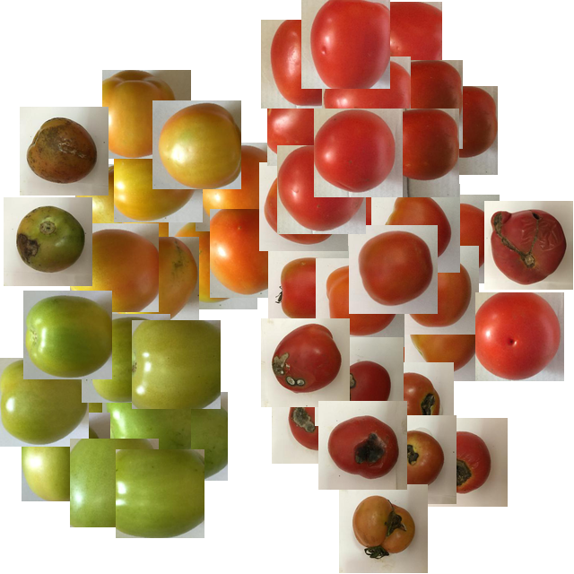
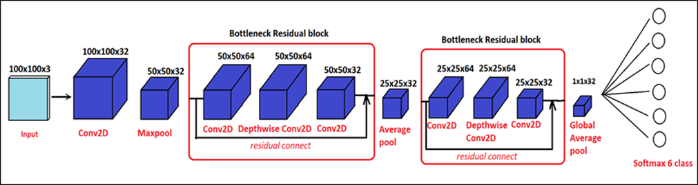

# Tomato-classification-system

> This is my graduation project about the tomato classification system. This project includes 3 part described below.

## 1. Core classification model (Convolutional neural network combined with Grad-CAM visualization):

* [Classification](Classification)

## 2. PCB and circuit diagram:

* [PCB](PCB)

## 3. Code for controller (STM32F103C8T6):

* [Controller-STM32F1](Controller-STM32F1)
